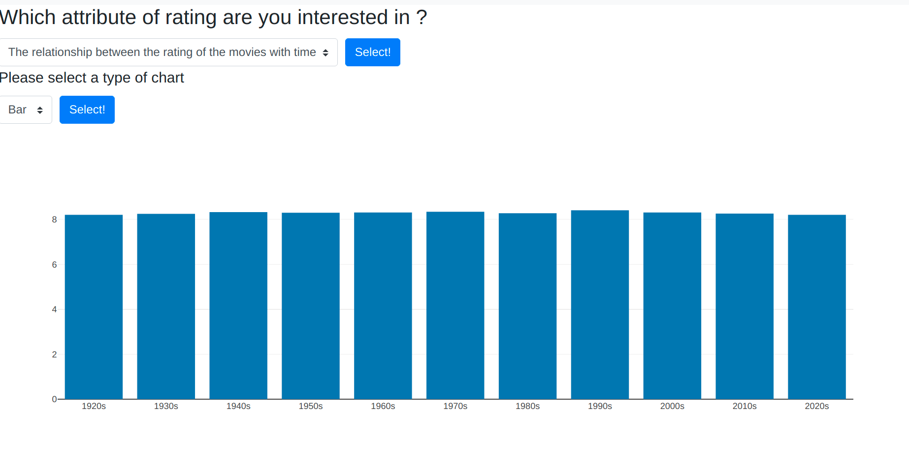

# Scraping-on-IMDb

# Installation: 
you can intall the requirements by anaconda or pip
* python=3.8.5
* beautifulsoup4==4.9.3
* flask==1.1.2
* jinja2==2.11.3
* pandas==1.2.4
* plotly==4.14.3
* requests==2.25.1
* sqlite==3.35.4
### conda environment setting
```
conda env create -f environment.yml -n si507
```
### Start conda environment
```
conda activate si507
```

# Data Proparation
**crawling.py:** The function will scrape the chart from [IMDB](https://www.imdb.com/chart/top/), and crawl the data like box, casts, directors...  <br>
Also, we use caching, thus the cache cache data will be solved into cache_data

**json2sql.py:** The function will turn the raw data we scraped online into sql database and generate the file called top_movie.sqlite

# Interaction and Presentation
**interact.py**
After running interact.py, you will lauch a local server and generate a website.
<br>So please go to http://127.0.0.1:5000/ on your web browser.

First, you can see the home page.<br>
There are three options for users to select.<br> 
They can either use the botton or the navigation headers. <br>


Second, after selecting the type of information, the users can use the scroll down menu to find some more detail information they want.


For some type of information, the users can also select the way to see the data.


